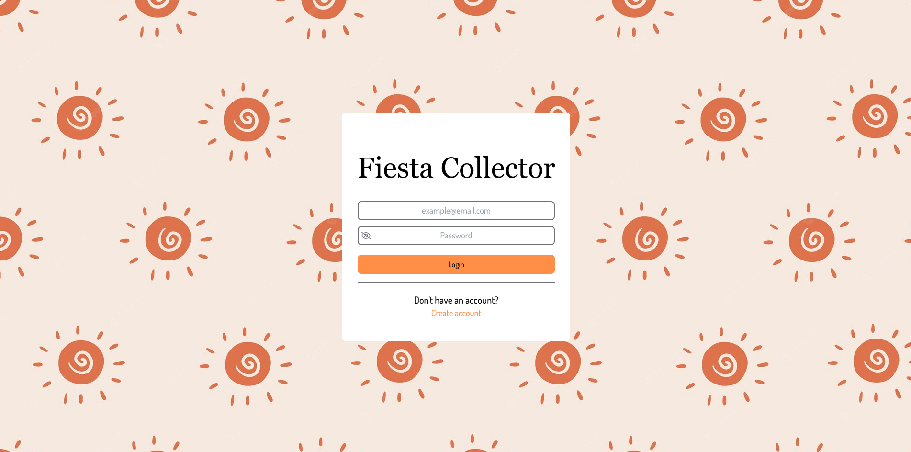
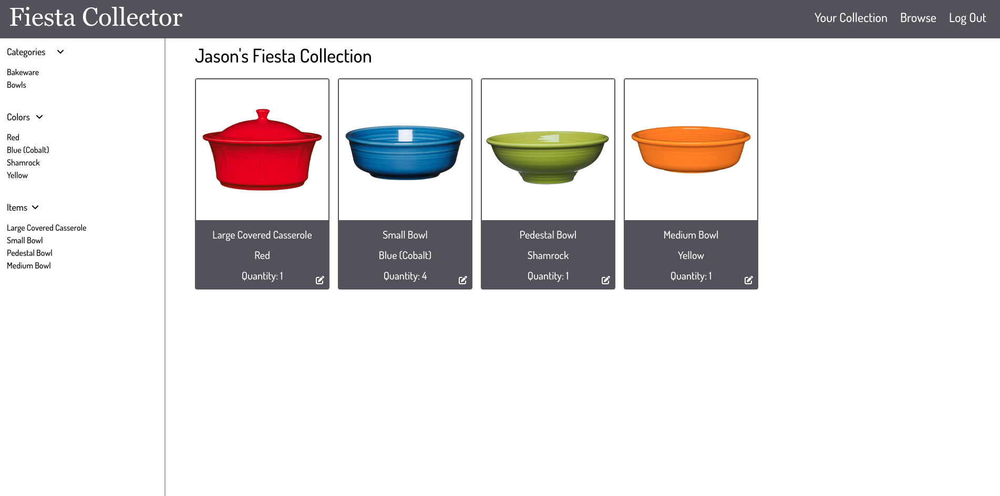
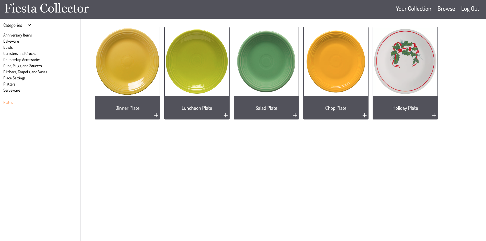
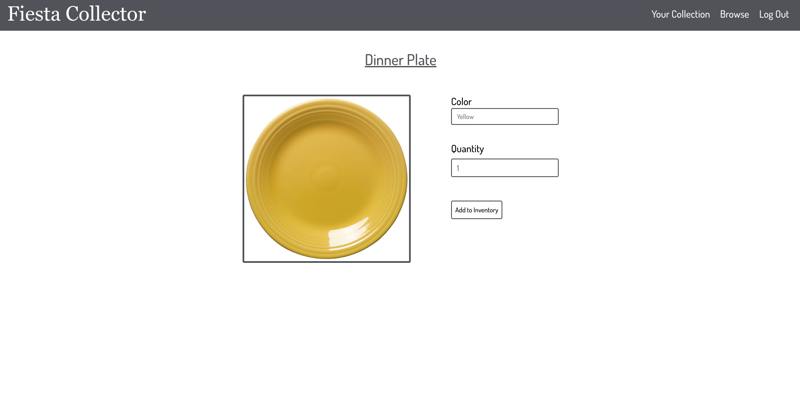

# Fiesta-Collector

## Description

This is a website dedicated to anyone and everyone who loves to collect Fiesta dinnerware, a line of ceramic glazed dinnerware that is very popular among lovers of colorful and decorative dishes. We used a combination of bcrypt, dotenv, express, handlebars, mysql, sequelize, prettier, eslint, concurrently, nodemon and  tailwindcss.

## Installation

To install necessary dependencies, run the following commands:
```
npm i
npm run seed
```

## Usage

This website is used to keep track of your personal collection of Fiesta dishes. You are able to browse through all of the dishes provided and select which one/ones you have. You are then able to put then in your collection. You are able to brows both by type of dish, dish set and color. You are also allowed to select how many of each dish you have if you have multiples. If you no longer have a dish or set you are then able to remove it from your collection.

## Link to deployed site

https://fiesta-collector.herokuapp.com/login

## Screenshots







## Credits
Amanda Johns https://github.com/MasakiSenpai

Jason Lieb https://github.com/jason-lieb

Vadim Race https://github.com/Git-Vdim-Hub

Alex Norrell https://github.com/alexnorrell
